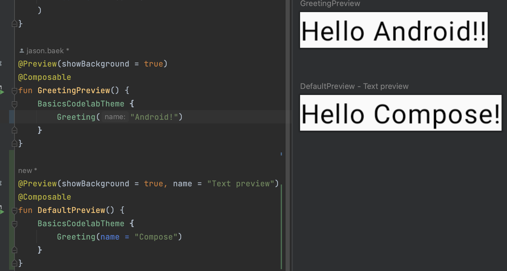
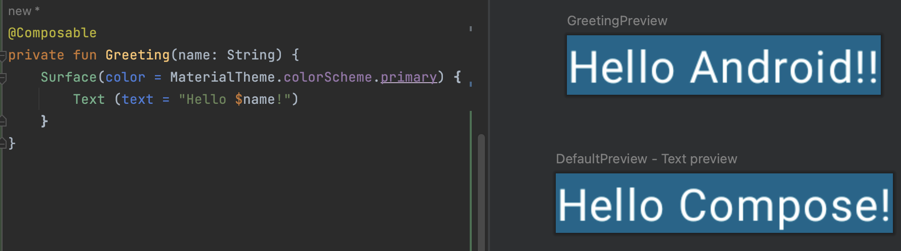
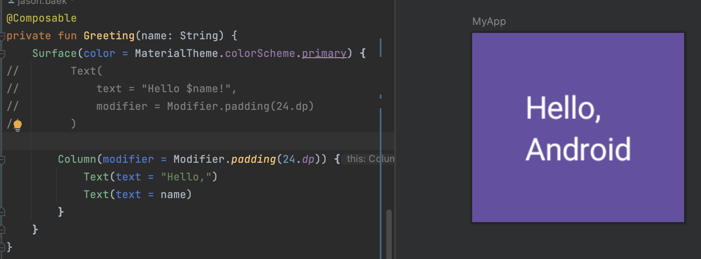
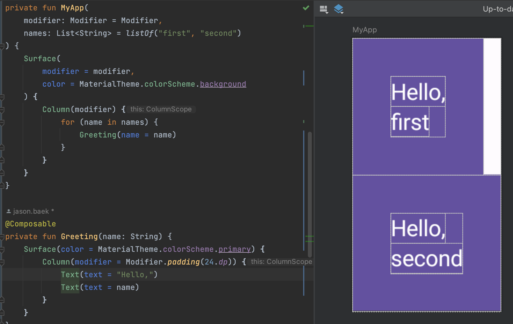
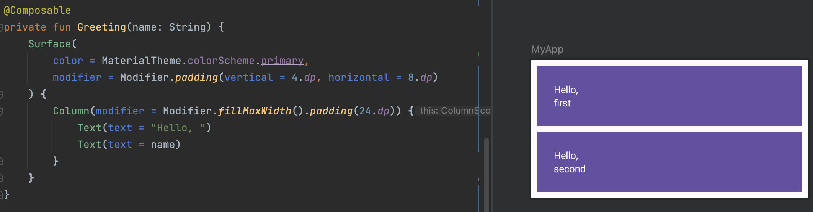
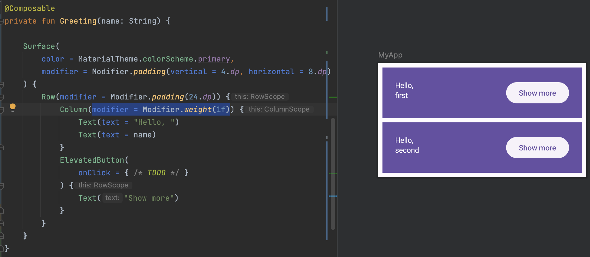

# 코드랩 - Jetpack Compose 기초
코드랩 링크: https://developer.android.com/codelabs/jetpack-compose-basics?hl=ko#0


잿팩 컴포즈는 데이터가 변경되면 프레임워크가 함수(@Composable)를 자동으로 다시 실행하여 UI 계층 구조를 업데이트하는 방식으로 이뤄진다.

이제 더이상 XML 에서 데이터바인딩을 사용하지 않아도 되므로 매우매우..편리하다.

코드랩은 이번에 stable 로 출시된 플라밍고 버전으로 진행하였고 코드랩에서는 머터리얼3 를 기준으로 작성되어있다.

참고로 컴포즈는 DSL 형태로 코딩하기 때문에 람다에 대해서 잘알고있으면 좋다.

아래와 같이 애니메이션으로 항목이 펼쳐지는 목록과 온보딩 화면이 포함된 앱을 코드랩에서 진행하게된다

온보딩이란?: https://yozm.wishket.com/magazine/detail/1522/


 


## 1~3. Compose 시작하기

참고: minimumSdkVersion 으로 API 수준 21(롤리팝 5.0) 이상을 선택해야한다. 이는 Compose에서 지원하는 최소 API 이다.

UI 를 표시하는 함수들은 @Composable 이라는 어노테이션을 추가해준다.

컴포즈는 이렇게 @Composable 로 지정된 함수들로 구성되며 그 안에서도 @Composable 의 조합으로 만들어진다.

```kotlin
@Composable
fun Greeting(name: String, modifier: Modifier = Modifier) {
    Text(
        text = "Hello $name!",
        modifier = modifier
    )
}
```

액티비티는 ComponentActivity 를 상속받고있는데 참고로 상속관계는 아래와 같으며 Ref 에 "Jetpack Compose 가 UI를 그리기 까지의 여정" 이라는글을 참고해보면 좋다.

상속관계: Activity <- ComponentActivity <- FragmentActivity <- AppCompatActivity 


 

컴포즈를 사용하면 이렇게 수정된 내용을 바로 프리뷰에서도 확인이 가능해서 생산성이 증가한다.


## 4. UI 조정

Greeting에 다른 배경 색상을 설정하려면 Text 컴포저블을 Surface 로 래핑하면 된다. 

Surface 는 androidx.compose.ui.graphics.Color 를 사용하므로 MaterialTheme.colorScheme.primary 를 사용한다.

참고: Surface 및 MaterialTheme 은 Material Design 과 관련된 개념이며, Material Design 은 사용자 인터페이스와 환경을 만드는 데 도움을 주기 위해 Google 에서 만든 디자인 시스템

 

### modifier
Surface 및 Text 와 같은 대부분의 Compose UI 요소는 modifier 매개변수를 선택적으로 허용한다. 

modifier 는 상위 요소 레이아웃 내에서 UI 요소가 배치되고 표시되고 동작하는 방식을 UI 요소에 알려준다.

예를 들어, padding 은 modifier 가 데코레이션하는 요소 주변의 공간을 나타낸다. Modifier.padding()으로 패딩 modifier 를 만들 수 있다.

아래와같이 Text 에 패딩을 추가할 수 있다.

```kotlin
@Composable
private fun Greeting(name: String) {
    Surface(color = MaterialTheme.colorScheme.primary) {
        Text(
            text = "Hello $name!",
            modifier = Modifier.padding(24.dp)
        )
    }
}
```

## 5. 컴포저블 재사용

기존 View 시스템에서는 상속개념으로 커스텀뷰를 만드느라 복잡하고 변경이 힘들었는데

컴포즈는 합성과 주입방식으로 개발되기 때문에 커플링이 감소하고 변경에 용이해졌다.

아래와 같이 MyApp 컴포저블을 재사용하여 코드 중복을 피할 수 있다.

```kotlin
class MainActivity : ComponentActivity() {
    override fun onCreate(savedInstanceState: Bundle?) {
        super.onCreate(savedInstanceState)
        setContent {
            BasicsCodelabTheme {
//                Surface(modifier = Modifier.fillMaxSize(), color = MaterialTheme.colorScheme.background) {
//                    Greeting("Android")
//                }
                MyApp(modifier = Modifier.fillMaxSize())
            }
        }
    }


    @Composable
    private fun MyApp(modifier: Modifier = Modifier) {
        Surface(
            modifier = modifier,
            color = MaterialTheme.colorScheme.background
        )   {
            Greeting("Android")
        }
    }
}
```

## 6. 열과 행 만들기
Compose 의 3 가지 기본 표준 레이아웃 요소는 Column, Row, Box 이다.

 


 

그리고 for 루프를 사용하여 Column 에 요소를 여러개 추가할 수 있다

 

스크롤만 추가하면 어댑터가 없어도 이렇게 list 표시를 쉽게 할 수 있다.

@Preview 에 widthDp 추가하여 소형 스마트폰의 일반적인 너비인 320dp 로 에뮬레이션도 가능하다

```kotlin

@Preview(showBackground = true, widthDp = 320)
```


그리고 midifier 에 메소드체이닝으로 fillMaxWidth 속성을 추가 할 수 있다.
 

### 버튼 추가

Button 은 material3 패키지에서 제공하는 컴포저블로, 컴포저블을 마지막 인수로 사용

후행 람다는 괄호 밖으로 이동할 수 있으므로 모든 콘텐츠를 버튼에 하위 요소로 추가할 수 있다. 

 

## 7. Compose 에서의 상태


```kotlin
@Composable
private fun Greeting(name: String) {
    var expanded = false

    Surface(
        color = MaterialTheme.colorScheme.primary,
        modifier = Modifier.padding(vertical = 4.dp, horizontal = 8.dp)
    ) {
        Row(modifier = Modifier.padding(24.dp)) {
            Column(modifier = Modifier.weight(1f)) {
                Text(text = "Hello, ")
                Text(text = name)
            }
            ElevatedButton(
                onClick = { expanded = !expanded }
            ) {
                Text(if (expanded) "Show less" else "Show more")
            }
        }
    }
}
```


위에 코드를 적용해도 상태 변경이 되지 않는다.

Compose 앱은 구성 가능한 함수를 호출하여 데이터를 UI로 변환한다. 

데이터가 변경되면 Compose 는 새 데이터로 이러한 함수를 다시 실행하여 업데이트된 UI 를 만든다. 이를 리컴포지션이라고 한다.

또한, Compose 는 데이터가 변경된 구성요소만 다시 구성하고 영향을 받지 않는 구성요소는 다시 구성하지 않고 건너뛰도록 개별 컴포저블에서 필요한 데이터를 확인한다.

다음은 [Compose 이해](https://developer.android.com/jetpack/compose/mental-model?hl=ko#recomposition) 에 언급된 내용

위에 코드에서 리컴포지션을 트리거하지 않는 이유는 이 expanded 변수를 Compose 에서 추적하고 있지 않기 때문이다. 

또한, Greeting 이 호출될 때마다 변수가 false 로 재설정된다.

컴포저블에 내부 상태를 추가하려면 mutableStateOf 함수를 사용하면 된다. 

이 함수를 사용하면 Compose 가 이 State 를 읽는 함수를 재구성한다.

State 및 MutableState 는 어떤 값을 보유하고 그 값이 변경될 때마다 UI 업데이트(리컴포지션)를 트리거하는 인터페이스이다.

```kotlin
import androidx.compose.runtime.mutableStateOf

@Composable
fun Greeting() {
    val expanded = mutableStateOf(false)
}
```

하지만 리컴포지션이 일어날때 상태가 다시 false 로 재설정되기 때문에 

여러 리컴포지션 간에 상태를 유지하려면 remember 를 사용하여 변경 가능한 상태를 기억해야 한다.

```kotlin
import androidx.compose.runtime.mutableStateOf
import androidx.compose.runtime.remember

@Composable
fun Greeting() {
    val expanded = remember { mutableStateOf(false) }
}

```
remember 는 리컴포지션을 방지하는 데 사용되므로 상태가 재설정되지 않는다.

화면의 서로 다른 부분에서 동일한 컴포저블을 호출하는 경우 자체 상태 버전을 가진 UI 요소를 만든다. 

내부 상태는 클래스의 비공개 변수로 보면 된다. 구성 가능한 함수는 상태를 자동으로 '구독'한다. 상태가 변경되면 이러한 필드를 읽는 컴포저블이 재구성되어 업데이트를 표시한디.

```kotlin
@Composable
private fun Greeting(name: String) {
    val expanded = remember { mutableStateOf(false) }

    Surface(
        color = MaterialTheme.colorScheme.primary,
        modifier = Modifier.padding(vertical = 4.dp, horizontal = 8.dp)
    ) {
        Row(modifier = Modifier.padding(24.dp)) {
            Column(modifier = Modifier.weight(1f)) {
                Text(text = "Hello, ")
                Text(text = name)
            }
            ElevatedButton(
                onClick = { expanded.value = !expanded.value }
            ) {
                Text(if (expanded.value) "Show less" else "Show more")
            }
        }
    }
}
```


### 항목 펼치기

```kotlin
@Composable
private fun Greeting(name: String) {

    val expanded = remember { mutableStateOf(false) }

    val extraPadding = if (expanded.value) 48.dp else 0.dp

    Surface(
        color = MaterialTheme.colorScheme.primary,
        modifier = Modifier.padding(vertical = 4.dp, horizontal = 8.dp)
    ) {
        Row(modifier = Modifier.padding(24.dp)) {
            Column(modifier = Modifier
                .weight(1f)
                .padding(bottom = extraPadding)
            ) {
                Text(text = "Hello, ")
                Text(text = name)
            }
            ElevatedButton(
                onClick = { expanded.value = !expanded.value }
            ) {
                Text(if (expanded.value) "Show less" else "Show more")
            }
        }
    }
}
```


이제 onClick 시 expanded 값에 따라서 column 의 패딩 dp 값이 변할것이다.


## 8. State hoisting

여기서는 상태 호이스팅을 이용해서 아래 앱의 온보딩 화면을 구현한다.


```kotlin
@Composable
fun OnboardingScreen(modifier: Modifier = Modifier) {
    // TODO: This state should be hoisted
    var shouldShowOnboarding by remember { mutableStateOf(true) }

    Column(
        modifier = modifier.fillMaxSize(),
        verticalArrangement = Arrangement.Center,
        horizontalAlignment = Alignment.CenterHorizontally
    ) {
        Text("Welcome to the Basics Codelab!")
        Button(
            modifier = Modifier.padding(vertical = 24.dp),
            onClick = { shouldShowOnboarding = false }
        ) {
            Text("Continue")
        }
    }
}

@Preview(showBackground = true, widthDp = 320, heightDp = 320)
@Composable
fun OnboardingPreview() {
    BasicsCodelabTheme {
        OnboardingScreen()
    }
}
```

shouldShowOnboarding 은 = 대신 by 키워드를 사용하고 있다. 이 키워드는 매번 .value 를 입력할 필요가 없도록 해주는 속성 위임

그 뒤 내용은 shouldShowOnboarding 을 최상단으로 hoisting (끌어올리기) 하고

shouldShowOnboarding 값을 OnboardingScreen 에 전달하는 식으로 구현한다.

이 과정에 대한 설명은 생략.


## 9. 성능 지연 목록 만들기

지금까지는 2개만 지정해서 row 를 구성하였지만 이번 단원에서는 여러개의 row 를 구성하는 방법을 알려준다.

LazyColumn 혹은 LazyRow 를 사용하는데 Android 뷰의 RecyclerView 와 동일하다.

LazyColumn 및 LazyRow 는 화면에 보이는 항목만 렌더링하므로 항목이 많은 목록을 렌더링할 때 성능이 향상된다.

```kotlin
import androidx.compose.foundation.lazy.LazyColumn
import androidx.compose.foundation.lazy.items
...

@Composable
private fun Greetings(
    modifier: Modifier = Modifier,
    names: List<String> = List(1000) { "$it" }
) {
    LazyColumn(modifier = modifier.padding(vertical = 4.dp)) {
        items(items = names) { name ->
            Greeting(name = name)
        }
    }
}
```


LazyColumn 은 RecyclerView 와 같은 하위 요소를 재활용하지 않기 때문에 reuse 이슈가 없지만 새로 리컴포지션하기 때문에 상태값은 초기화가 된다.
컴포저블을 방출하는 것은 Android Views 를 인스턴스화하는 것보다 상대적으로 비용이 적게 들므로 LazyColumn 은 스크롤 할 때 새 컴포저블을 방출하고 계속 성능을 유지한다.


## 10. 상태 유지
앱에 한 가지 문제가 있다. 기기에서 앱을 실행하고 버튼을 클릭한 다음 회전하면 온보딩 화면이 다시 표시된다. 

remember 함수는 컴포저블이 컴포지션에 유지되는 동안에만 작동한다. 기기를 회전하면 전체 활동이 다시 시작되므로 모든 상태가 손실된다. 

이 현상은 구성이 변경되거나 프로세스가 중단될 때도 발생한다.

remember를 사용하는 대신 rememberSaveable을 사용하면 된다. 이 함수는 구성 변경(예: 회전)과 프로세스 중단에도 각 상태를 저장한다.

이제 shouldShowOnboarding 에서 remember를 rememberSaveable 로 교체하여 사용하면 문제가 해결된다.

```kotlin
    var shouldShowOnboarding by rememberSaveable { mutableStateOf(true) }
```

rememberSaveable 은 기존 안드로이드 View 에서 SaveState 같은 기능이라 보면 될 것 같다.


## 11. 목록에 애니메이션 적용


## Ref.
### Jetpack Compose basics code-along(머터리얼2기준)
- 링크:  https://youtu.be/k3jvNqj4m08
- 머터리얼2 기준이며 1시간짜리 분량인데 상당히 좋은 내용들이 포함되어있는것 같아서 시간될때 봐야할 것 같다

### Jetpack Compose 가 UI를 그리기 까지의 여정

- 링크: https://sungbin.land/jetpack-compose%EA%B0%80-ui-%EB%A5%BC-%EA%B7%B8%EB%A6%AC%EA%B8%B0-%EA%B9%8C%EC%A7%80%EC%9D%98-%EC%97%AC%EC%A0%95-967589afa45


### 고차 함수 및 람다 표현식

- 링크: https://developer.android.com/jetpack/compose/kotlin?hl=ko#higher-order