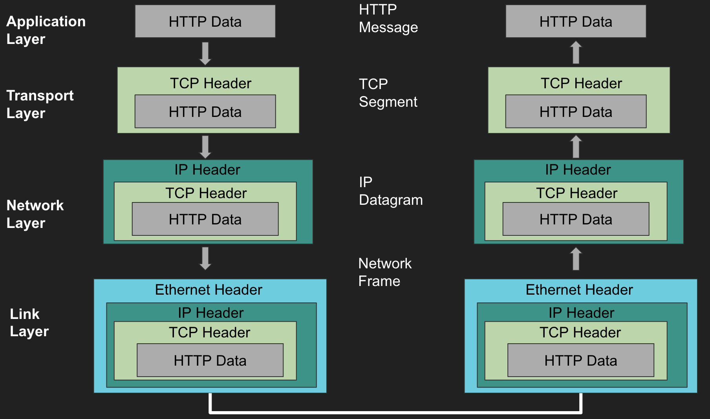

# The flow of TCP/IP
To understand HTTP, it is necessary to have some knowledge of the TCP/IP protocol.

FYI...HTML and JSON are types of data transmitted through HTTP

HTTP is a protocol included in TCP/IP.

I will post about HTTP next time.

## TCP/IP has four layers

Application Layer, Transport Layer, Network Layer, Data Link layer

## Application Layer

TCP/IP has several common applications, such as FTP and DNS, that belong to the application layer. HTTP is also included in this layer.

## Transport Layer

The transport layer has two protocols, TCP and UDP.

In the application layer, packets are called messages. Each layer has a different term for packets. In the transport layer, they are called segments.

The transport layer encapsulates application layer messages into segments and forwards them to the network layer.


### TCP: Transmission Control Protocol

1. Used for communications such as web and email, where data must be transmitted accurately.
2. Regulates transmission speed to ensure accurate delivery of data to the destination and retransmits any data that was not received.

### UDP: User Diagram Protocol

Used for communication where fast transmission speed is required, such as VoIP and video streaming.


### Port Number
Each layer determines the PORT number based on the transmitted port number.
```
[HTTP: 80][SMTP: 25][POP3: 110][TFTP: 80][NTP: 25][SNMP: 110]
[            TCP: 6           ][          UDP: 17           ]
```   

## Network Layer
In the network layer, the route that a packet should take to reach the destination computer is determined.

## Data Link Layer
The link layer deals with the hardware aspects of connecting to the network.

## The flow of TCP/IP
Each layer adds necessary information for that layer in the headers when passing through it.


